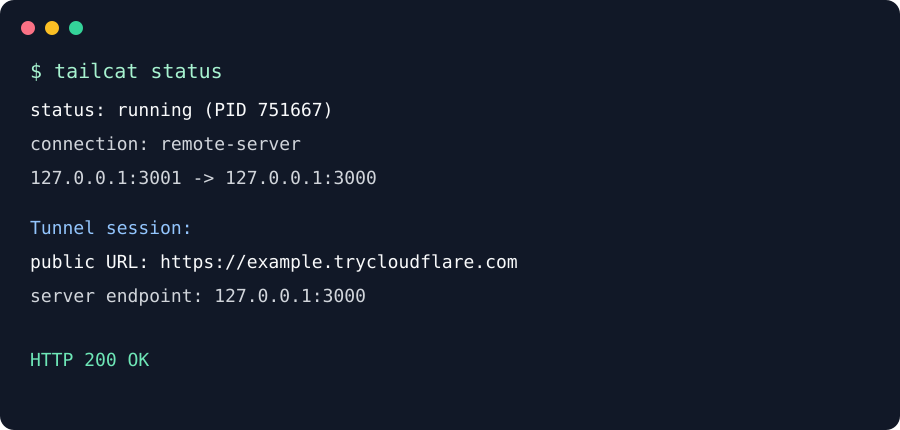
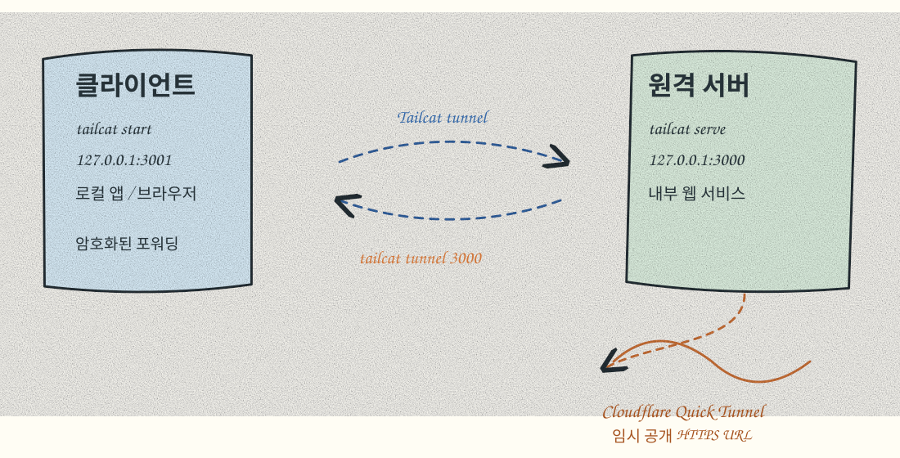

# tailcat-kadap

클라이언트와 원격 서버 사이의 포트 연결을 관리하고, 필요할 때 외부 미리보기 URL을 만드는 Bash 기반 도구입니다.

## 요구 사항

- Ubuntu/Debian 계열 클라이언트
- Bash, SSH, `sshpass`, `curl`, `jq`, `unzip`
- Tailcat 연결을 실행할 원격 서버와 SSH 계정
- `tunnel` 사용 시 원격 서버의 `sudo` 권한과 인터넷 연결
- Quick Tunnel은 테스트용 공개 주소이므로 운영 인증 수단으로 사용하지 않음

## 실행 절차

1. 클라이언트에 저장소를 내려받고 저장소 디렉터리로 이동합니다.

   ```bash
   git clone https://github.com/bigdata-car/tailcat-kadap.git
   cd tailcat-kadap
   ```

2. `~/.local/bin` 디렉터리를 만들고 `tailcat` 실행 파일을 복사합니다. 첫 번째 명령은 디렉터리만 만들며 실행 파일을 설치하지 않습니다.

   ```bash
   install -d -m 755 ~/.local/bin
   install -m 755 tailcat ~/.local/bin/tailcat
   export PATH="$HOME/.local/bin:$PATH"
   ```

   위 세 단계는 `tailcat install`으로도 실행할 수 있습니다. `tailcat uninstall`은 설치된 `~/.local/bin/tailcat` 파일을 제거합니다. 현재 셸의 `PATH` 변수는 명령이 직접 삭제할 수 없으므로, 언인스톨 후 새 셸을 열거나 `export PATH=...`를 다시 적용해야 합니다.

   `tailcat` 파일이 현재 디렉터리에 있는지 확인하려면 다음을 실행합니다.

   ```bash
   ls -l ./tailcat
   ```

3. 클라이언트에서 원격 서버 연결을 설정합니다.

   ```bash
   tailcat setup
   ```

4. 설정된 포워더를 시작하고 상태를 확인합니다.

   ```bash
   tailcat start
   tailcat status
   ```

5. 현재 포트 매핑을 확인합니다.

   ```bash
   tailcat list
   ```

6. 포트를 추가하거나 삭제합니다.

   ```bash
   tailcat add <remote-port> <local-port>
   tailcat del <local-port>
   ```

   `add`는 로컬 포트 점유 여부와 원격 포트 리스닝 여부를 확인한 뒤 매핑을 추가합니다. `del`은 지정한 로컬 매핑을 삭제합니다.

7. 외부 공개가 필요할 때만 Quick Tunnel을 시작합니다. 이때 원격 서버에 `cloudflared`가 없으면 설치합니다.

   ```bash
   tailcat tunnel 3000
   tailcat status
   ```

8. 연결 설정을 초기화할 때는 확인 절차가 있는 `reset`을 사용합니다.

   ```bash
   tailcat reset
   ```

9. 클라이언트 명령을 제거할 때는 `uninstall`을 사용합니다.

   ```bash
   tailcat uninstall
   ```

`setup` 단계에서는 원격 서버에 `cloudflared`를 설치하지 않습니다. `tunnel`을 실행할 때만 설치합니다.

## 목적

- 원격 서버의 내부 서비스를 클라이언트 로컬 포트로 전달
- 연결을 `start`, `stop`, `status`로 관리
- 포트 매핑을 `add`, `del`, `list`로 관리
- `tunnel` 실행 시에만 서버에 Cloudflare Quick Tunnel을 설치하고 외부 HTTPS URL 생성
- `reset`으로 연결별 설정과 원격 서비스를 확인 절차 후 정리

## 활용 오픈소스

- [Tailscale Tailcat](https://github.com/tailscale/tailcat): Tailscale 데이터 플레인을 이용한 암호화 TCP 연결
- [cloudflared](https://github.com/cloudflare/cloudflared): Cloudflare Quick Tunnel 클라이언트
- [Cloudflare Quick Tunnels 문서](https://developers.cloudflare.com/cloudflare-one/networks/connectors/cloudflare-tunnel/do-more-with-tunnels/trycloudflare/)

`cloudflared`는 `setup` 때 설치하지 않습니다. `tunnel`을 실행할 때 서버에 없으면 해당 시점에 설치합니다. Quick Tunnel은 개발·테스트용이며 프로세스가 종료되면 공개 URL도 종료되고, URL은 재시작 시 바뀔 수 있습니다.

## 스크린샷



## 클라이언트–서버 동작 과정



클라이언트의 `tailcat`이 원격 서버의 Tailcat 주소로 암호화된 연결을 만들고, 로컬 포트를 원격 서비스 포트로 전달합니다. `tunnel`은 원격 서버에서 실행되어 서버의 HTTP 포트를 Cloudflare 네트워크를 통해 임시 공개 HTTPS 주소로 연결합니다.

## 사용법

```text
tailcat                         도움말 표시
tailcat start                   저장된 포워더 시작
tailcat stop                    포워더 중지
tailcat status                  포워더와 Tunnel session 상태 표시
tailcat list                    포트 매핑 목록
tailcat add <remote> <local>   원격 포트 추가 및 로컬 매핑
tailcat del <local>             로컬 매핑 제거
tailcat tunnel [remote-port]   외부 Quick Tunnel 생성 (기본 3000)
tailcat reset                  확인 후 연결 설정 초기화
tailcat install                ~/.local/bin/tailcat 설치
tailcat uninstall              ~/.local/bin/tailcat 제거
```

예시:

```bash
tailcat start
tailcat add 22 2022
tailcat tunnel 3000
tailcat status
```

`tailcat add`는 로컬 포트가 비어 있는지, 원격 대상 포트가 실제로 리스닝 중인지 확인합니다. `tailcat reset`은 `RESET <연결명>` 확인 문자열을 요구하며, 클라이언트 바이너리와 `tailcat` 명령은 유지합니다.

## 주의사항

Quick Tunnel URL은 공개 인터넷에서 접근 가능하므로 민감한 관리 화면을 그대로 노출하지 마세요. 상시 운영에는 계정 기반 Cloudflare Tunnel과 인증 정책을 사용해야 합니다.
